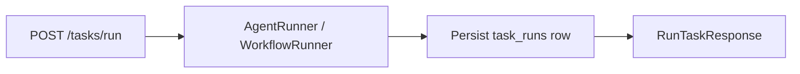

# Task execution flow (agent run)

## Overview

`POST /tasks/run` executes a single tenant agent or workflow and persists the result to `task_runs`.

## Request

Required fields: `objective`, `slug`, and exactly one of `agent_id` or `workflow_id`.

Optional `context` is a free-form natural language / markdown string (prose, JSON in code fences, or both). It is not validated against a schema.

## Runtime

1. Load `AgentDef` or `WorkflowDef` from tenant storage.
2. Build execution payload: `{ objective, context? }` from the request.
3. **Single agent:** `AgentRunner` seeds ADK session state (`objective`, `user_input`) and runs one turn.
4. **Workflow:** `WorkflowCompiler` builds an ADK `Workflow` graph with per-node instructions (step objective + prior-step `{agent_*_out?}` placeholders). `WorkflowRunner` seeds session state (`objective`, `user_input`) and calls `run_async` — ADK schedules the graph and chains step outputs via `output_key`.
5. Persist `request_context` as the raw context string (or null).

### Workflow node objectives (ADK-native)

Each workflow node may define `objective` in the workflow JSON. At compile time this is appended to that node's `LlmAgent.instruction`, along with:

- `{objective?}` and `{user_input?}` — run context from session state
- `{agent_<prior_id>_out?}` — optional prior step outputs via ADK `output_key` handoff

ADK edge tuple `("START", *agents_in_order)` runs steps sequentially so prior outputs are available to downstream nodes.

## Key modules

| Module | Role |
|--------|------|
| `src/api/routes/tasks.py` | HTTP entry, persistence |
| `src/core/orchestration/service.py` | Thin task orchestration wrapper |
| `src/core/agents/runner.py` | Agent execution + session seeding |
| `src/core/workflows/compiler.py` | Compile workflow graph + per-node instructions |
| `src/core/workflows/runner.py` | ADK workflow execution |
| `src/core/agents/workflow_instructions.py` | Workflow instruction augmentation |
