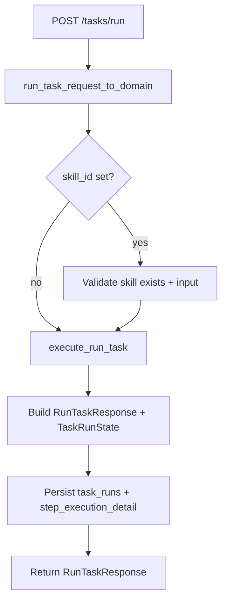
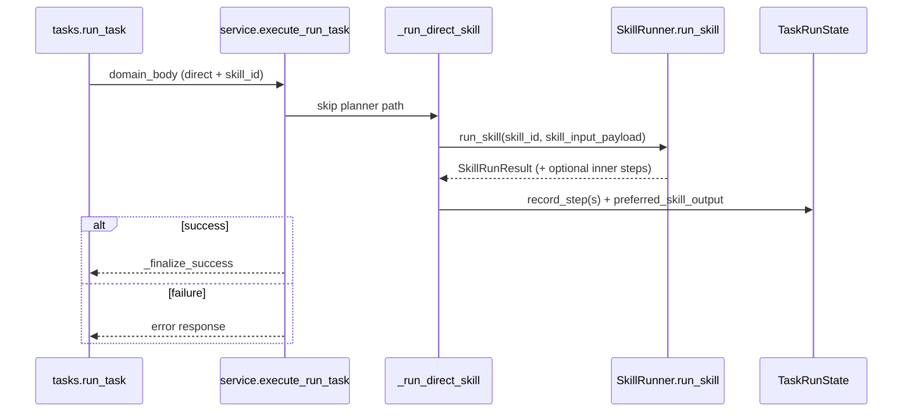
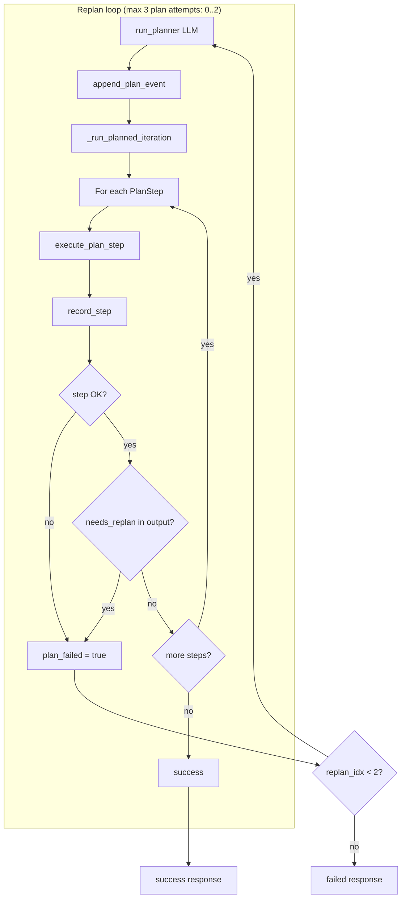
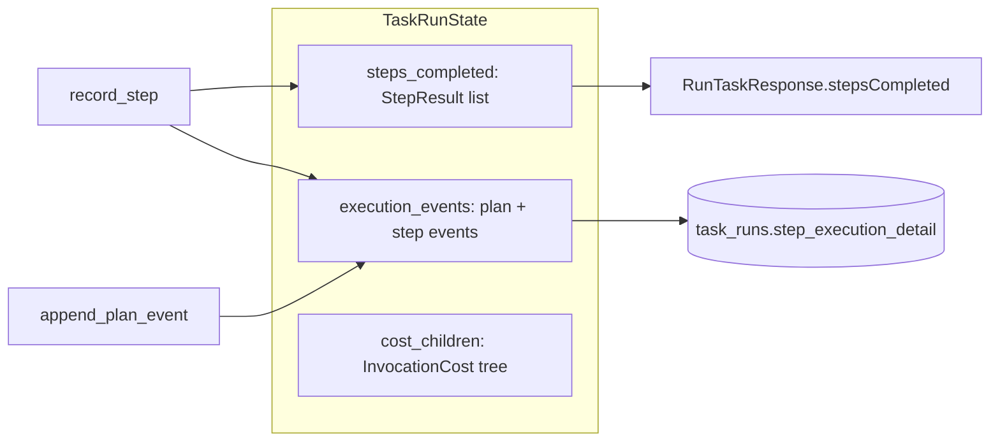

# Task orchestration flow

How `POST /tasks/run` runs tasks in **direct skill** mode vs **plan + execute + replan** mode.

## Entry point (both scenarios)

Every run starts at `POST /tasks/run`:



| Layer | File | Role |
|--------|------|------|
| HTTP | `src/api/routes/tasks.py` | Validation, calls orchestration, persists run |
| Orchestration | `src/core/orchestration/service.py` | **Branch**: direct vs plan/execute/replan |
| Models | `src/core/orchestration/models.py` | `PlanStep`, `ExecutionPlan`, `TaskRunState`, `record_step` |

### Execution mode

Set on the request (`executionMode` / `execution_mode`):

| Mode | Behavior |
|------|----------|
| **`orchestrate`** (default) | Discover tenant skills/tools, LLM planner, execute plan, replan on failure |
| **`direct`** | Requires `skillId`; runs that skill once (no planner; success or error only) |

Defined in `src/api/models/schemas.py` (`RunTaskRequest.execution_mode`) and mapped in `src/api/translators/tasks.py` (`RunTaskRequestDomain.execution_mode`).

---

## Scenario 1: Direct skill invocation

**When:** `executionMode: "direct"` **and** `skillId` is set.



### Steps in code

1. `execute_run_task` checks `execution_mode == "direct"` first (`service.py`).
2. `_run_direct_skill` calls `runner.run_skill` once with merged input (`task`, `objective`, `prior_steps`, plus request `input`) via `skill_input_payload`.
3. Steps are recorded in `execution_events` (timeline) and `steps_completed` (API DTOs). Composed skills may expand to multiple inner steps.
4. On success, `preferred_skill_output` is set and the function returns immediately — **no `run_planner`**. On failure, the same step timeline is returned with an error — **still no `run_planner`**.

**Validation:** `executionMode: "direct"` without `skillId` is rejected at request validation (**422**) before orchestration runs.

---

## Scenario 2: Planner + execution (+ replan)

**When:** default `orchestrate` (direct mode never enters this path; it only runs the single-skill path above).



### Planner phase

`run_planner` (`planner.py`):

1. Builds tenant capability catalog via `build_capability_catalog` (`catalog.py`): skills from DB + tool descriptors from `SkillRunner`.
2. Sends JSON to the `task_planner` agent with structured output `ExecutionPlan`.
3. Payload includes: task prompt, `tenantId`, optional `skillId` hint, `input`, `availableSkills`, `availableTools`, `completedSteps`, and optional `replanReason` on retries.
4. Appends a **`type: "plan"`** event via `append_plan_event` (`execution_detail.py`).

On replan, `completedSteps` is built from prior **step** events only (`completed_steps_for_planner`).

### Execution phase

`_run_planned_iteration` walks `plan.steps` and calls `execute_plan_step` (`executor.py`) for each `PlanStep`:

| `stepType` | Handler | What it does |
|------------|---------|----------------|
| `invoke_skill` | `execute_plan_step` | Load skill def, validate input (includes `prior_steps`), `runner.run_skill` |
| `invoke_tool` | same | `runner.resolve_tool` → `tool.execute(**params)` |
| `synthesize` | same | Inline LLM agent reads `task` + `prior_steps`, returns synthesized output |

After each step, `record_step` updates `steps_completed` and `execution_events`.

**Replan triggers:**

- Any step fails.
- Skill output has `needs_replan: true` or `insufficient_data: true` (`_output_requests_replan` in `service.py`).

**Loop cap:** `_MAX_REPLANS = 2` → at most **3** planner invocations (initial + 2 replans).

### Response output (orchestrated)

`resolve_run_task_output` (`translators/tasks.py`) picks `RunTaskResponse.output` in order:

1. `preferred_skill_output` (direct path only).
2. Output from the step whose `skillId` matches request `skill_id` (hint).
3. Last successful step with non-null output (`extract_final_orchestration_output`).

---

## Shared state: timeline vs API steps

Both paths accumulate the same structures in `TaskRunState`:



### Event shape (schema version 1)

Persisted under `task_runs.step_execution_detail` (`execution_detail_for_persist`):

- **`type: "plan"`** — `reasoning`, optional `replanReason`, planned `steps`.
- **`type: "step"`** — `action` (the `PlanStep`) + `result` (`success`, `payload`, `error`).

---

## Side-by-side decision table

| Request | Planner? | Execution |
|---------|----------|-----------|
| `direct` + `skillId` | **No** | Single `run_skill` |
| `direct` + no `skillId` | — | **422** (request validation) |
| `direct` + skill fails | **No** | Record step event(s) + error response |
| `orchestrate` (default) | Yes | Plan → steps → maybe replan |
| `orchestrate` + `skillId` | Yes (`skillId` is planner hint) | Same; output prefers hinted skill if present |

---

## Module map

```
src/api/routes/tasks.py          # HTTP: validate, execute_run_task, persist
src/core/orchestration/
  service.py                     # State machine: direct shortcut vs replan loop
  planner.py                     # LLM → ExecutionPlan
  executor.py                    # Per-step dispatch (skill / tool / synthesize)
  catalog.py                     # Tenant skills + tools for planner
  execution_detail.py            # Plan/step timeline for persistence
  models.py                      # PlanStep, ExecutionPlan, TaskRunState, record_step
src/core/skills/runner.py        # SkillRunner.run_skill (direct + planned steps)
```

### Mental model

1. **Route layer** — validates and persists; no planning logic.
2. **Service** — owns the state machine: direct shortcut vs replan loop.
3. **Planner** — LLM chooses an `ExecutionPlan` from tenant capabilities.
4. **Executor** — deterministic dispatch per step type.
5. **SkillRunner** — actual skill composition/agents (used in both direct and planned `invoke_skill` steps).
